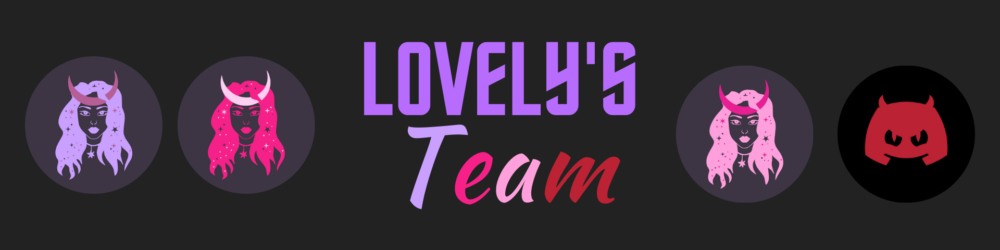

# Lovely's Team Documentation

## Lovely's Team

### About

Lovely's Team is a Discord team that runs the following bots:

* **Luná -** [**Invite**](https://discord.com/oauth2/authorize?client_id=826216708867620905&permissions=8&scope=bot%20applications.commands)
  * Luná is designed to help keep your server safe and make it easier to moderate users. Luná can moderate your server, verify new members, and much more! Luná has a 24/7 uptime and only down for maintenance or a Discord outage.
* **Luná Beta -** [**Invite**](https://discord.com/oauth2/authorize?client_id=848038043897561129&permissions=8&scope=bot%20applications.commands)
  * Luná Beta is an unstable version of Luná. Luná Beta is used to test new features that might be added to Luná in the future. We do not recommend you using this bot as it has many bugs!
* **Luná Play - Coming Soon...**
  * Luná Play is designed to be a fun bot. Luná Play contains features such as reaction commands, a free leveling system, and action commands. As the bot is still brand new, many features are still being planned!
* **Demon Portal - Coming Soon...**
  * Demon Portal can be used to help out advertising servers. Demon Portal was designed to send advertisements to certain channels with certain categories.

### Important Links

* [Community Server](https://discord.com/invite/QNKr7tpQzW)
* Advertising Server _Coming soon..._
* [Support Server](https://discord.com/invite/SwsPSXvATk)
* [Partnership Form](https://forms.gle/ZPx5thxrToLsGVkG8)
* [Luná Invite](https://discord.com/oauth2/authorize?client_id=826216708867620905&permissions=8&scope=bot%20applications.commands)
* [Luná Beta Invite](https://discord.com/oauth2/authorize?client_id=848038043897561129&permissions=8&scope=bot%20applications.commands)

